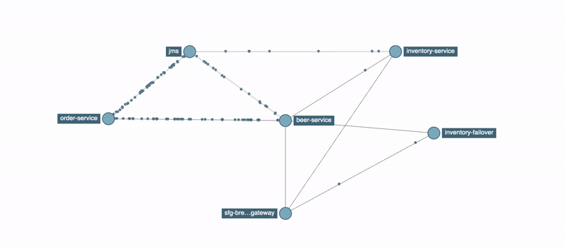

# Spring Boot Microservices

To run locally:  

1. run jms docker:  
docker run -it --rm \
  -p 8161:8161 \
  -p 61616:61616 \
  vromero/activemq-artemis

2. Run zipkin docker:  
docker run -d -p 9411:9411 openzipkin/zipkin

3. Run all services  
- Eureka: https://github.com/KonstantinKochetov/mssc-brewery-eureka
- Config: https://github.com/KonstantinKochetov/mssc-config-server
- Gateway: https://github.com/KonstantinKochetov/mssc-brewery-gateway
- Beer service: https://github.com/KonstantinKochetov/mssc-beer-service
- Order service: https://github.com/KonstantinKochetov/mssc-beer-order-service
- Inventory service: https://github.com/KonstantinKochetov/mssc-beer-inventory-service
- Inventory failover service: https://github.com/KonstantinKochetov/mssc-inventory-failover 

4. Make some requests from a client (like Postman) 

5. Visualize it: http://localhost:9411/, go to dependencies page, choose a date and search  

